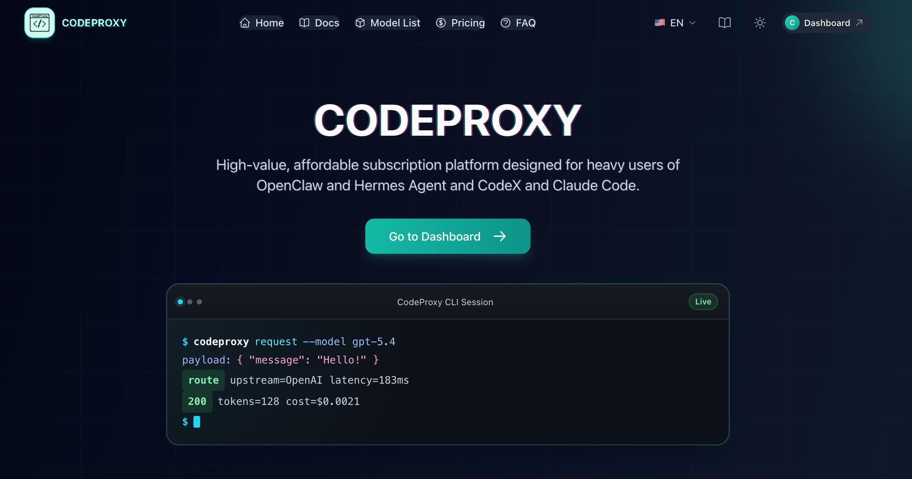

# Ray Growth OS

**中文** | [English](README.md)

一个开源、本地优先的 AI 增长工作台：把 X 上的公开讨论沉淀成一套可重复执行的流程——发现、审核、排序、生成草稿、执行与复盘。

> 当前状态：本地 MVP。适合独立开发者和小团队验证增长工作流；它不是托管式 CRM，也不是自动群发工具。

> 第一次使用？先看 [使用指南：从定位到反馈复盘](docs/USER_GUIDE.zh-CN.md)。

## 项目赞助

<a href="https://codeproxy.dev/register?aff=KTYG4RK7">
  
</a>

[CodeProxy](https://codeproxy.dev/register?aff=KTYG4RK7) 为 OpenClaw、Hermes Agent、Codex 和 Claude Code 用户提供订阅服务。

使用邀请码注册，赠送 **2 美元体验金**和 **1 日订阅套餐**（自动发放）。邀请码：`KTYG4RK7`

## 它能做什么

```text
定位
  → 发现公开讨论（手动 Grok 或中转自动查询）
  → 导入并去重信号
  → 本地规则 + AI 优先级排序
  → 回复 / 引用 / 选题 / 可选私下跟进草稿
  → 执行与结果记录
  → 把经验沉淀为下一轮可复用的增长记忆
```

- 定义产品或账号、目标人群、主题/痛点与互动策略。
- 根据定位自动生成 X 公开讨论搜索 Prompt。
- 选择一种找人方式：
  - **手动方式**：复制 Prompt 到 Grok，将结果粘贴回工作台；
  - **自动方式**：通过用户配置的 Grok/codeproxy 查询，先审核结构化结果再导入。
- 使用**竞品洞察**分析公开竞品、KOL、社区或目标用户账号，从其受众周围发现外部讨论。
- 使用本地规则与可选 AI 语义评分给队列排序。
- 生成贴合原帖的回复、引用帖、内容选题和可选私下跟进草稿。
- 记录执行与反馈，将真实结果转化为下一轮可撤销的筛选与写作规则。

## 数据来源与边界

Ray Growth OS **不提供私有线索库，也不会暗中抓取非公开账号数据**。

| 输入 | 如何进入工作台 | 说明 |
| --- | --- | --- |
| X 公开讨论 | 从 Grok 手动粘贴，或通过中转查询 | 导入前需要人工审核；结构化 Prompt 明确禁止编造链接。 |
| X 公开账号信息 | 竞品洞察流程 | 只读取公开主页/页面材料；不读取私信或私有分析数据。 |
| CSV 或粘贴文本 | Signal 导入 | 可用于来自其他合规数据源的结果。 |
| 执行结果 | 手动标记或插件同步 | 仅用于本地调整下一轮优先级。 |

线索质量取决于你的定位、模型能力和公开数据源可用性。请把所有 AI 建议视为草稿；发布前核对相关性、事实、链接与平台政策。

## 快速开始

前置条件：Node.js 22.5 或更高版本与 npm。项目直接使用 Node 内置 SQLite，不需要另装数据库服务。

```bash
npm install
npm run dev
```

打开 [http://localhost:3001](http://localhost:3001)。

工作台首次打开为空白状态，请先填写你自己的产品或账号定位，再开始搜索。

### 可选 AI 配置

在应用的**设置**页中可以配置：

- Grok/codeproxy 的密钥和模型：用于自动发现公开讨论与竞品洞察；
- AI Responses 兼容的密钥和模型：用于定位建议、语义评分、草稿和增长记忆；
- 一个可选的公开 X 主页地址：用于生成可编辑的定位初稿。

设置和新工作台数据会保存到本机 SQLite 数据库，因此同一台电脑、同一端口下打开的不同浏览器会读取同一份数据。首次升级只会迁移当前浏览器中已有的 Grok、AI 和 X 主页设置；旧定位、队列、评分、草稿、反馈和增长记忆不会迁移，方便从空白工作台重新测试。

工作台写入采用版本校验，不再使用“最后一次写入直接覆盖”。多个页面或插件同时更新时会先合并再重试；页面加载后如果数据没有变化不会重复写库；SQLite 还会保留最近 100 个旧版本作为本地恢复记录。

数据库默认位置：Windows 为 `%LOCALAPPDATA%\RayGrowthOS\ray-growth-os.db`，macOS 为 `~/Library/Application Support/RayGrowthOS/ray-growth-os.db`，Linux 为 `$XDG_DATA_HOME/ray-growth-os/ray-growth-os.db`（未设置时使用 `~/.local/share/ray-growth-os/`）。可通过 `RAY_GROWTH_OS_DATA_DIR` 修改目录。

这仍然是本地单用户安全模型：API 密钥只保存在本机，也不会进入工作台 JSON 备份，但并没有使用托管密钥系统保护。若要部署给多位用户，请先迁移到服务端密钥管理。

`.env.local.example` 说明了 AI 路由可选的服务端兜底环境变量。对本地开发而言，直接在应用设置页配置最简单。

## 常用命令

```bash
npm run dev        # 在 3001 端口启动 Next.js
npm start          # 在 3001 端口运行已完成的生产构建
npm run typecheck  # TypeScript 检查
npm test           # 单元测试
npm run build      # 生产构建
```

## 国际化

- 默认语言：简体中文（`zh-CN`）
- 已支持语言：English（`en`）
- 语言选择保存在 `ray-growth-os:locale:v1`。
- 导航、总览、定位找人、查询方式、设置页以及模型生成语言会随选择切换；用户自行填写和导入的原始内容不会被擅自翻译。

## 可选 Chrome 插件：X Helper

仓库内置的 **Ray Growth OS X Helper** 用于补齐人工在 X 回复后的反馈回流。它是可选的：不安装也能使用工作台，并且你始终可以手动记录结果。

### 它做什么

1. 从工作台打开原帖时，自动读取并关联当前互动条目。
2. 关联 X 原帖与你亲自发送的回复。
3. 当回复出现在 X 公开页面中时，保存该回复链接。
4. 巡检公开互动结果，并回写到本地工作台。

它**不会**替你发布回复、读取私信、绕过登录，也不会调用 X 付费 API。

### 本地安装（开发者模式）

1. 启动工作台，并保持 `http://localhost:3001` 或 `http://127.0.0.1:3001` 页面打开。
2. 在 Chrome 打开 `chrome://extensions/`，开启右上角的**开发者模式**。
3. 点击**加载已解压的扩展程序**。
4. 选择目录 [`extension/ray-growth-os-x-helper`](extension/ray-growth-os-x-helper)。
5. 如需快速使用，可以将 **Ray Growth OS X Helper** 固定到浏览器工具栏。

### 使用流程

1. 在 App 设置中保存公开 X 主页，或者在插件弹窗里保存一次 X 用户名（`@` 后面的部分）；弹窗不需要保持打开。
2. 从工作台点击**复制回复并打开原帖**。插件会自动读取并关联当前条目，不需要手动读取队列。
3. 由你本人在 X 上回复。
4. 回复出现在当前原帖对话页后，插件会自动回写；若漏抓，点击**找回当前页回复并回写**。
5. 只有回复链接已经记录后，才点击**巡检已记录的回复链接**检查后续公开反馈。

“巡检已记录的回复链接”不能反向找回从未保存的回复链接。更新插件代码后，需在 `chrome://extensions/` 点击“重新加载”，并刷新已打开的 App/X 页面。
如果 App 当时未打开，之后保持工作台页面打开，再点击**手动回写暂存反馈**。

插件依赖 X 公开页面 DOM；X 的页面结构变化后可能需要适配。更具体的中文实现说明见[插件 README](extension/ray-growth-os-x-helper/README.md)。

## 提示词设计

内置提示词强调可执行性，而非营销话术：

- 只使用已提供或公开的上下文；
- 不虚构意图、指标、链接、私有数据、服务承诺或结果；
- 严格按结构化 Schema 输出；
- 区分已观察到的反馈与假设；
- 使用当前界面选定的输出语言；
- 将身份/产品信息视为披露规则，而非生成销售文案的许可。

## 项目结构

```text
src/app/page.tsx                 工作台主界面
src/app/settings/page.tsx        本地连接与主页设置
src/app/api/*                    Grok 与 AI 中转路由
src/lib/grok-utils.ts            搜索 Prompt 构建与解析
src/lib/llm-*.js                 评分、草稿、定位、复盘的结构化提示词
src/lib/signals.js               Signal 标准化、导入与反馈复盘包
src/lib/workbench-state.ts       本地状态、迁移、备份与恢复
test/*.test.mjs                  单元测试
extension/ray-growth-os-x-helper 可选的 X 反馈助手
```

## 参与贡献

1. 创建范围明确的分支。
2. 不要提交生成的或真实的用户数据。
3. 提交 PR 前运行 `npm run typecheck`、`npm test` 和 `npm run build`。
4. 改动提示词时，请新增或更新保护安全边界、输出契约的单元测试。

欢迎贡献：合规数据连接器、服务端密钥管理、团队工作区、结果归因、更多语言与无障碍改进。

## 安全与负责任使用

- 不要将私信、凭据、非公开客户数据粘贴到 Prompt 中。
- 遵守 X 与每个数据提供方的条款、限流与同意要求。
- 每条生成内容都应由人工审核后再发送；本项目用于辅助人工互动，而不是自动化垃圾信息。
- 导出的备份可能包含工作台数据和草稿，请妥善保存 JSON 文件。

## 许可证

当前仓库尚未选择许可证。在公开发布或接受外部贡献前，请选择并添加许可证（例如 MIT 或 Apache-2.0）。
